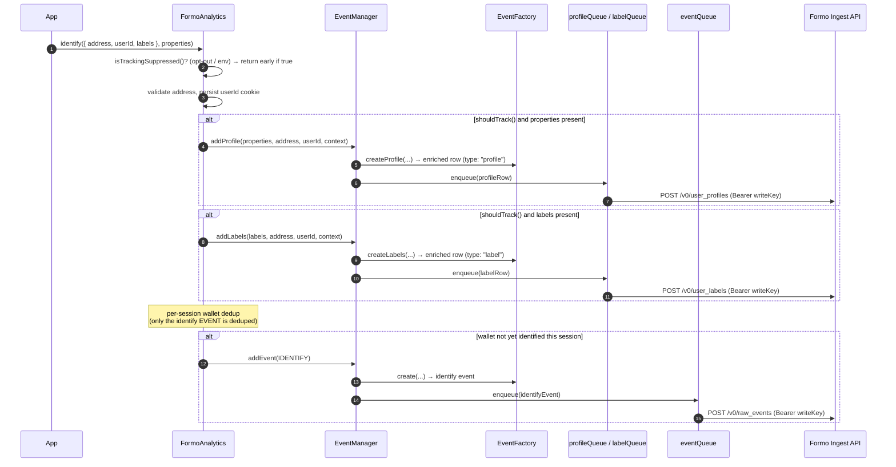

# Profile Properties & Labels

## Overview

The Formo Web SDK can write **user profile properties** and **user labels** to
two dedicated stores — the `user_profiles` and `user_labels` datasources — in
addition to the raw event log (`raw_events`).

These writes are **folded into `identify()`**:

- The `properties` argument is upserted to **`user_profiles`** (and is still
  included on the `identify` event in `raw_events` for backward compatibility).
- A new **`labels`** field (key-value) on the `identify()` params is upserted to
  **`user_labels`**.

Both upserts reuse the existing Events API — same host, same `Bearer <writeKey>`
auth, and the same `EventQueue` retry / keepalive / consent machinery — but POST
to sibling datasource paths.

| Concept | Datasource | Written by | Example |
| --- | --- | --- | --- |
| Events (page, connect, identify, track, …) | `raw_events` | all tracking methods | `formo.track('minted', { volume: 1 })` |
| Profile properties (traits) | `user_profiles` | `identify(params, **properties**)` | `{ email, twitter, plan }` |
| Labels (key-value) | `user_labels` | `identify({ …, **labels** })` | `{ tier: 'gold', kyc: true }` |

> **Profiles vs. labels.** Both are key-value. Use **properties** for descriptive
> traits that belong to the user's profile (email, plan, social handles). Use
> **labels** for classification/segmentation flags you filter or group on
> (`tier`, `kyc`, `is_team`). They live in separate datasources so they can be
> modeled and queried independently.

---

## Quick start

```ts
import { FormoAnalytics } from '@formo/analytics';

const formo = await FormoAnalytics.init('YOUR_WRITE_KEY');

// Profile properties only → user_profiles (+ identify event in raw_events)
await formo.identify(
  { address: '0xabc…', userId: 'user_123' },
  { email: 'alice@acme.xyz', plan: 'pro' }
);

// Profile properties + labels → user_profiles AND user_labels
await formo.identify(
  {
    address: '0xabc…',
    userId: 'user_123',
    labels: { tier: 'gold', kyc: true },
  },
  { email: 'alice@acme.xyz', plan: 'pro' }
);

// Labels only
await formo.identify({
  address: '0xabc…',
  userId: 'user_123',
  labels: { tier: 'gold' },
});
```

---

## Architecture

### High-level flow

```
formo.identify({ address, userId, labels }, properties)
            │
            ▼
     FormoAnalytics.identify()
            │  (suppression + shouldTrack() gate, address validation, userId cookie)
            ├──────────────► EventManager.addProfile(properties) ─► profileQueue ─► POST /v0/user_profiles
            ├──────────────► EventManager.addLabels(labels)      ─► labelQueue   ─► POST /v0/user_labels
            └──────────────► trackEvent(IDENTIFY)  (per-session dedup) ─► eventQueue ─► POST /v0/raw_events
```

Each datasource has its **own `EventQueue` instance**, but all three share the
same write key and the same opt-out consent gate.

### Sequence diagram



The profile/label upserts run **before** the per-session identify dedup, so a
repeat `identify()` for an already-identified wallet still flushes updated
traits/labels even though the `identify` *event* is suppressed. The queue's own
payload-hash dedup still prevents exact-duplicate spam within a flush window.

---

## How it works

### 1. Endpoint resolution

The profiles/labels hosts are derived from the configured events `apiHost` by
`resolveDatasourceHost()` (`src/constants/config.ts`):

```ts
export function resolveDatasourceHost(
  eventsApiHost: string,
  override: string | undefined,
  datasource: string
): string | null {
  if (override) return override;                       // explicit option wins
  if (eventsApiHost === EVENTS_API_HOST) {             // default host
    return `${EVENTS_API_ORIGIN}/v0/${datasource}`;    // → …/v0/user_profiles
  }
  const suffix = `/${RAW_EVENTS_DATASOURCE}`;          // custom host ending in
  if (eventsApiHost.endsWith(suffix)) {                //   /raw_events → swap
    return eventsApiHost.slice(0, -RAW_EVENTS_DATASOURCE.length) + datasource;
  }
  return null;                                         // non-derivable → disabled
}
```

| Configured `apiHost` | Derived `user_profiles` host | Derived `user_labels` host |
| --- | --- | --- |
| _(default)_ `https://events.formo.so/v0/raw_events` | `https://events.formo.so/v0/user_profiles` | `https://events.formo.so/v0/user_labels` |
| `https://my-proxy.com/ingest/raw_events` | `https://my-proxy.com/ingest/user_profiles` | `https://my-proxy.com/ingest/user_labels` |
| `/api/analytics` (non-derivable) | `null` → **disabled** (warns) unless `profilesApiHost` set | `null` → **disabled** (warns) unless `labelsApiHost` set |

When a host can't be derived, that write is disabled and a warning is logged;
set `profilesApiHost` / `labelsApiHost` explicitly to enable it.

### 2. Per-datasource queues

`FormoAnalytics` constructs one `EventQueue` per datasource, all sharing the same
options and consent gate, then hands them to the `EventManager`:

```ts
this.eventManager = new EventManager(
  {
    events:   new EventQueue(writeKey, { ...baseQueueOptions, apiHost: eventsApiHost }),
    profiles: profilesApiHost ? new EventQueue(writeKey, { ...baseQueueOptions, apiHost: profilesApiHost }) : null,
    labels:   labelsApiHost   ? new EventQueue(writeKey, { ...baseQueueOptions, apiHost: labelsApiHost })   : null,
  },
  options
);
```

`EventManager.clear()` (called on opt-out / teardown) drains **all three**
queues so nothing buffered can leak after consent withdrawal.

### 3. Row construction

`EventFactory` builds each row through the same `getEnrichedEvent()` helper used
for events, so profile/label rows carry the identical identity envelope
(`anonymous_id`, `user_id`, `address`, `channel`, `version`,
`original_timestamp`, `context`) and have their keys snake-cased:

```ts
async createProfile(properties, address?, userId?, context?): Promise<IFormoProfileRow> {
  const profileRow = { properties: { ...properties }, address: address ?? null, user_id: userId ?? null, type: "profile" };
  return this.getEnrichedEvent(profileRow, context);          // payload under `properties`
}

async createLabels(labels, address?, userId?, context?): Promise<IFormoLabelRow> {
  const enriched = await this.getEnrichedEvent(
    { properties: { ...labels }, address: address ?? null, user_id: userId ?? null, type: "label" },
    context
  );
  const { properties, ...rest } = enriched;                   // re-key `properties` → `labels`
  return { ...rest, labels: properties };
}
```

### 4. The identify() wiring

```ts
// Upsert profile properties (user_profiles) and labels (user_labels) on
// every identify() call, BEFORE the per-session identify-event dedup below,
// so changed traits/labels always reach the stores. Gated by shouldTrack().
if (this.shouldTrack()) {
  if (properties && Object.keys(properties).length > 0) {
    await this.eventManager.addProfile(properties, validAddress, userId, context);
  }
  if (labels && Object.keys(labels).length > 0) {
    await this.eventManager.addLabels(labels, validAddress, userId, context);
  }
}
```

---

## API reference

### `identify(params, properties?, context?, callback?)`

#### `params`

| Field | Type | Required | Destination | Description |
| --- | --- | --- | --- | --- |
| `address` | `string` | ✅ | — | Wallet address the profile/labels attach to. Validated (EVM/Solana). |
| `userId` | `string` | — | — | External user ID; persisted to the identity cookie. |
| `providerName` | `string` | — | `raw_events` | Wallet provider display name (identify event). |
| `rdns` | `string` | — | `raw_events` | Provider reverse-DNS id (identify event + dedup key). |
| `labels` | `Record<string, unknown>` | — | **`user_labels`** | Key-value labels, e.g. `{ tier: 'gold', kyc: true }`. |

#### Positional arguments

| Arg | Type | Destination | Description |
| --- | --- | --- | --- |
| `properties` | `IFormoEventProperties` (`Record<string, unknown>`) | **`user_profiles`** + `raw_events` | Profile traits, e.g. `{ email, plan }`. |
| `context` | `IFormoEventContext` | all | Optional context overrides merged into the auto-collected context. |
| `callback` | `(...args) => void` | — | Invoked after the identify event is processed. |

### `Options` (init)

| Option | Type | Default | Description |
| --- | --- | --- | --- |
| `apiHost` | `string` | `https://events.formo.so/v0/raw_events` | Events ingest host. Profiles/labels hosts are derived from it. |
| `profilesApiHost` | `string` | _derived_ | Override the `user_profiles` ingest URL. Required when `apiHost` is a non-derivable proxy. |
| `labelsApiHost` | `string` | _derived_ | Override the `user_labels` ingest URL. Required when `apiHost` is a non-derivable proxy. |

### Datasource endpoints

| Datasource | Default URL | Method | Auth |
| --- | --- | --- | --- |
| `raw_events` | `https://events.formo.so/v0/raw_events` | `POST` (JSON array) | `Authorization: Bearer <writeKey>` |
| `user_profiles` | `https://events.formo.so/v0/user_profiles` | `POST` (JSON array) | `Authorization: Bearer <writeKey>` |
| `user_labels` | `https://events.formo.so/v0/user_labels` | `POST` (JSON array) | `Authorization: Bearer <writeKey>` |

### `user_profiles` row

| Field | Type | Description |
| --- | --- | --- |
| `anonymous_id` | `string` (UUID) | Always present device/session id. |
| `user_id` | `string \| null` | External user id from `params.userId`. |
| `address` | `string \| null` | Validated wallet address. |
| `type` | `"profile"` | Row discriminator (informational; routing is by URL). |
| `channel` | `"web"` | SDK channel. |
| `version` | `string` | Payload version. |
| `original_timestamp` | `string` (ISO 8601) | When the upsert was created. |
| `context` | `object` | Auto-collected context (user agent, locale, page, UTM, …). |
| `properties` | `object` | **The profile traits** (snake-cased keys). |
| `message_id` | `string` | Payload hash for dedup (added at enqueue). |
| `sent_at` | `string` (ISO 8601) | When the batch was flushed (added at send). |

### `user_labels` row

Identical envelope to `user_profiles`, except the payload lives under `labels`
instead of `properties`, and `type` is `"label"`:

| Field | Type | Description |
| --- | --- | --- |
| _…envelope…_ | | Same as `user_profiles` (`anonymous_id`, `user_id`, `address`, `channel`, `version`, `original_timestamp`, `context`, `message_id`, `sent_at`). |
| `type` | `"label"` | Row discriminator. |
| `labels` | `object` | **The key-value labels** (snake-cased keys). |

### Constants & helpers (`src/constants/config.ts`)

| Export | Description |
| --- | --- |
| `RAW_EVENTS_DATASOURCE` / `USER_PROFILES_DATASOURCE` / `USER_LABELS_DATASOURCE` | Datasource path segment names. |
| `USER_PROFILES_API_HOST` / `USER_LABELS_API_HOST` | Default ingest URLs. |
| `resolveDatasourceHost(eventsApiHost, override, datasource)` | Derives a datasource URL (or `null`). |

### Types (`src/types/events.ts`)

| Type | Description |
| --- | --- |
| `IFormoProfileRow` | `user_profiles` row (alias of `IFormoEvent`; payload under `properties`). |
| `IFormoLabelRow` | `user_labels` row (envelope + `labels`). |
| `IFormoIngestRow` | `IFormoEvent \| IFormoLabelRow` — anything the queue can ingest. |

---

## Example payloads

`POST https://events.formo.so/v0/user_profiles`

```json
[
  {
    "anonymous_id": "1f3c…",
    "user_id": "user_123",
    "address": "0xabc…",
    "type": "profile",
    "channel": "web",
    "version": "0",
    "original_timestamp": "2026-06-26 00:00:00",
    "context": { "user_agent": "…", "locale": "en-US", "page_url": "https://app.acme.xyz/" },
    "properties": { "email": "alice@acme.xyz", "plan": "pro" },
    "message_id": "…",
    "sent_at": "2026-06-26T00:00:00.000Z"
  }
]
```

`POST https://events.formo.so/v0/user_labels`

```json
[
  {
    "anonymous_id": "1f3c…",
    "user_id": "user_123",
    "address": "0xabc…",
    "type": "label",
    "channel": "web",
    "version": "0",
    "original_timestamp": "2026-06-26 00:00:00",
    "context": { "user_agent": "…", "locale": "en-US", "page_url": "https://app.acme.xyz/" },
    "labels": { "tier": "gold", "kyc": true },
    "message_id": "…",
    "sent_at": "2026-06-26T00:00:00.000Z"
  }
]
```

---

## Usage examples

### Privy

`parsePrivyProperties()` already returns the profile `properties`; passing them to
`identify()` now upserts them to `user_profiles`. Add `labels` for classification.

```ts
import { parsePrivyProperties } from '@formo/analytics';

const { user } = usePrivy();
if (user) {
  const { properties, wallets } = parsePrivyProperties(user);
  for (const wallet of wallets) {
    await formo.identify(
      {
        address: wallet.address,
        userId: user.id,
        labels: { has_email: !!properties.email, embedded: wallet.isEmbedded },
      },
      properties // → user_profiles
    );
  }
}
```

### Self-hosted proxy

If you proxy the Events API, point `apiHost` at your `…/raw_events` route and the
sibling datasource URLs are derived automatically:

```ts
await FormoAnalytics.init('YOUR_WRITE_KEY', {
  apiHost: 'https://analytics.acme.xyz/ingest/raw_events',
  // → user_profiles: https://analytics.acme.xyz/ingest/user_profiles
  // → user_labels:   https://analytics.acme.xyz/ingest/user_labels
});
```

If your proxy path does **not** end in `/raw_events`, set the overrides:

```ts
await FormoAnalytics.init('YOUR_WRITE_KEY', {
  apiHost: '/api/analytics',
  profilesApiHost: '/api/analytics/profiles',
  labelsApiHost: '/api/analytics/labels',
});
```

---

## Behavior details

- **Consent.** Profile/label upserts respect `optOutTracking()` / the
  `shouldTrack()` gate (opt-out, `tracking: false`, excluded timezone/host/path,
  excluded chain). `optOutTracking()` drops anything already buffered in all
  three queues.
- **Dedup.** The upserts are intentionally **not** suppressed by the per-session
  wallet dedup, so updated traits/labels always flow. Exact-duplicate spam within
  one flush window is still blocked by the queue's payload-hash dedup.
- **Blocked addresses.** Rows whose resolved address is in the blocked list
  (zero / dead address) are dropped before enqueue, same as events.
- **Batching.** Profile/label rows use the same batching (default `flushAt: 20`,
  `flushInterval: 30s`), 64 KB keepalive splitting, and retry/backoff as events.
  For immediate sends during testing, init with `flushAt: 1`.
- **No wallet, no upsert.** Because the writes are folded into `identify()` (which
  requires an `address`), users without a wallet are not profiled. A standalone
  method would be needed if address-less profiles become a requirement.

> **Backend note.** Each upsert is sent as a single row with a JSON
> `properties` / `labels` object (mirroring `raw_events.properties`). Confirm the
> `user_profiles` / `user_labels` datasource schemas accept this shape (and the
> same write key). If `user_labels` is modeled one-row-per-label instead,
> `EventManager.addLabels()` can fan out one row per key — a small change.

---

## Testing locally

### 1. Fast path — unit & integration tests

```bash
pnpm install

# Everything
pnpm test

# Just the profiles/labels coverage
npx mocha --require ts-node/register --project tsconfig.test.json \
  'test/profiles/**/*.ts' 'test/lib/event/EventManager.spec.ts'
```

What's covered:

| Spec | Asserts |
| --- | --- |
| `test/profiles/identifyProfilesLabels.spec.ts` | `identify()` routes `properties`→`addProfile`, `labels`→`addLabels`; no-op when absent; **repeat identify still upserts while the identify event is deduped**; opt-out blocks upserts. |
| `test/lib/event/EventManager.spec.ts` | `addProfile`/`addLabels` enqueue to the right queue with the right shape (`labels` under `labels`, `type` discriminator); blocked-address drop; null-queue no-op; `clear()` drains all three. |
| `test/profiles/datasourceHost.spec.ts` | `resolveDatasourceHost()` default mapping, override precedence, `/raw_events` swap, non-derivable → `null`. |

Then verify lint, build, and bundle:

```bash
pnpm lint
pnpm build      # tsc (cjs + esm) + webpack UMD
pnpm size       # NOTE: budget (39 KB) is pre-existingly exceeded on main (~44.5 KB)
```

### 2. End-to-end — observe the three POSTs against a local mock

This proves the real wire behavior: three separate POSTs to `/v0/raw_events`,
`/v0/user_profiles`, `/v0/user_labels`, each with `Authorization: Bearer …`.

**a. Mock ingest server** — `mock-ingest.mjs` (Node built-ins only, also serves
the test page so there's no CORS):

```js
import { createServer } from 'node:http';
import { readFile } from 'node:fs/promises';

createServer(async (req, res) => {
  if (req.method === 'GET') {
    // Serve the harness + the built UMD bundle from dist/
    const path = req.url === '/' ? '/test.html' : req.url;
    try {
      const body = await readFile('.' + path);
      res.writeHead(200).end(body);
    } catch {
      res.writeHead(404).end('not found');
    }
    return;
  }
  // POST /v0/<datasource>
  let raw = '';
  req.on('data', (c) => (raw += c));
  req.on('end', () => {
    console.log(`\n▶ ${req.url}`);
    console.log('  auth:', req.headers['authorization']);
    console.log('  body:', JSON.stringify(JSON.parse(raw || '[]'), null, 2));
    res.writeHead(200, { 'content-type': 'application/json' }).end('{}');
  });
}).listen(8787, () => console.log('mock ingest on http://localhost:8787'));
```

**b. Test harness** — `test.html` (place at repo root next to `dist/`):

```html
<!doctype html>
<script src="/dist/index.umd.min.js"></script>
<script type="module">
  // The UMD bundle exposes the class as window.FormoAnalytics
  // (webpack output.library: "FormoAnalytics", libraryExport: "FormoAnalytics").
  const formo = await window.FormoAnalytics.init('TEST_WRITE_KEY', {
    apiHost: 'http://localhost:8787/v0/raw_events', // ends in /raw_events → siblings auto-derive
    flushAt: 1,                                     // send immediately (no 30s wait)
    logger: { enabled: true },
  });

  await formo.identify(
    { address: '0x82827Bc8342a16b681AfbA6B979E3D1aE5F28a0e', userId: 'user_123', labels: { tier: 'gold', kyc: true } },
    { email: 'alice@acme.xyz', plan: 'pro' }
  );
  console.log('identify sent — check the mock server logs');
</script>
```

**c. Run it:**

```bash
pnpm build
node mock-ingest.mjs
# open http://localhost:8787 in a browser, watch the server terminal
```

**Expected:** three logged POSTs —
`/v0/raw_events` (the identify event), `/v0/user_profiles`
(`properties: { email, plan }`), `/v0/user_labels` (`labels: { tier, kyc }`) —
each with the Bearer header.

### 3. Scenario checklist (in the same harness)

| Scenario | Action | Expected |
| --- | --- | --- |
| Profiles | `identify(params, properties)` | POST to `/v0/user_profiles` with `properties`. |
| Labels | `identify({ …, labels })` | POST to `/v0/user_labels` with `labels`. |
| Repeat upsert | call `identify(samePrams)` twice | 2× profile/label POSTs, **1×** identify event (deduped). |
| Opt-out | `formo.optOutTracking()` then `identify(...)` | **no** POSTs to any datasource. |
| Non-derivable host | init `apiHost: '/api/analytics'` (no overrides) | console warns; **no** profile/label POSTs; events still attempt `/api/analytics`. |
| Explicit overrides | add `profilesApiHost`/`labelsApiHost` | profile/label POSTs go to the override URLs. |

### 4. Type & API sanity

```bash
npx tsc -p tsconfig.json --noEmit --ignoreDeprecations 6.0
```

(The `--ignoreDeprecations` flag silences the repo's pre-existing
`target=ES5` / `moduleResolution=node10` config deprecations so real type errors
surface.)
```
